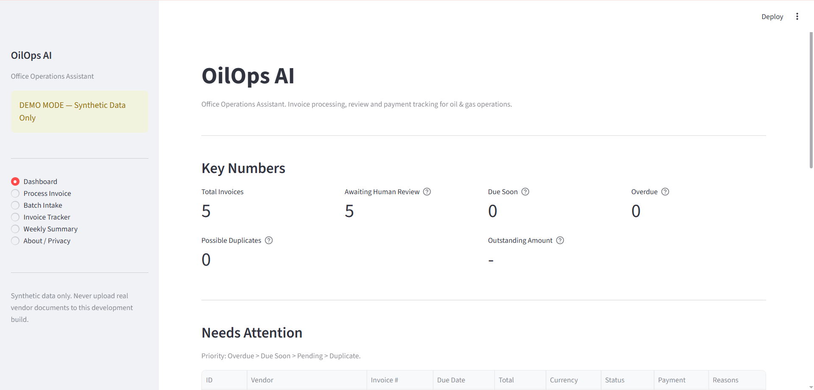
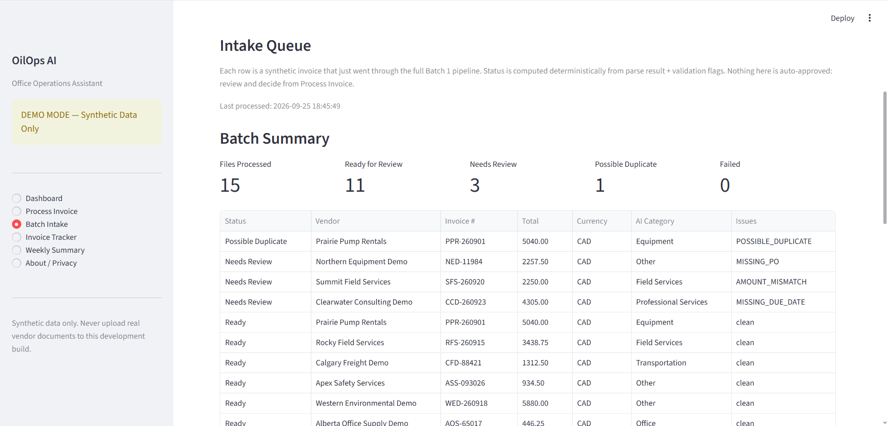
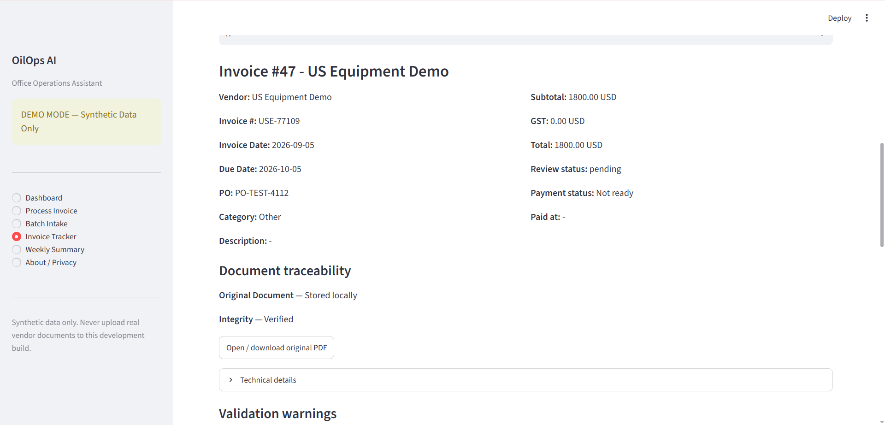

# OilOps AI

> **Privacy-first AI-assisted office automation for small oil & gas operations.**
> Synthetic data only. Working portfolio prototype. Not production accounting software.

[]()
[]()
[]()
[]()
[]()

OilOps AI is a Streamlit-based desktop prototype that automates the
*administrative* side of running a small upstream oil & gas operation:
invoices, bookkeeping prep, weekly status. It is intentionally **not** an
ERP, **not** an accounting system, **not** connected to any bank,
QuickBooks, or email provider, and **never** moves money on its own.
Every money-moving decision is left to a human.

This repository is a **portfolio piece**. All invoice fixtures are
**synthetic** - generated by `reportlab` in
`sample_data/synthetic_invoices/make_synthetic*.py`. No real vendor
information, real bank identifiers, or real PII is present in this
repository. Do not upload real vendor documents to a development build.

---

## Headline

A small upstream oil & gas operator receives dozens of vendor invoices
a month (field services, rentals, transport, fuel, lab analyses,
software, ...). Each one needs to be opened, parsed, matched against a
PO, checked for duplicates and missing fields, classified into an
expense category, approved by a person, tracked until paid, and
reported on at the end of the week.

OilOps AI does the **repetitive** parts locally and deterministically,
asks an LLM to **classify** the expense (with a safe deterministic
mock when no API key is present), and **never** moves money. The human
remains in control of approval, rejection, and "marked as paid".

**AI handles the office work. Humans keep the money.**

---

## Demonstrated Capabilities

| Capability                     | Where it lives                              |
| ------------------------------ | ------------------------------------------- |
| Batch invoice intake           | `services/batch_intake.py`                  |
| Local PDF parsing              | `services/invoice_parser.py`                |
| Structured field extraction    | `services/invoice_extractor.py`             |
| Privacy redaction              | `services/privacy_filter.py`                |
| Validation & duplicate detect  | `services/invoice_checker.py`               |
| AI expense classification      | `services/ai_classifier.py`                 |
| AI-safe narrative (opt-in)     | `services/weekly_summary.py`                |
| Human approval + mark-paid     | `app.py`                                    |
| Dashboard & KPIs               | `services/dashboard_service.py` + `app.py`  |
| Weekly summary                 | `services/weekly_summary.py` + `app.py`     |
| CSV bookkeeping export         | `services/csv_export.py`                    |
| Repository / persistence       | `services/invoice_repository.py`            |
| Document storage & traceability| `services/document_storage.py`              |
| End-to-end pipeline audit      | `tests/test_full_e2e.py`                    |

**E2E synthetic-invoice audit (V1.1.1, 15 multi-layout PDFs):**

```
vendor 15/15  invoice_number 15/15  invoice_date 15/15
due_date 14/14 (#14 expected empty)
po_number 14/14 (#6 expected empty)
subtotal 15/15  gst 15/15  total 15/15  currency 15/15
                                         ->  133 / 133 target fields
```

Special cases verified: `#6 MISSING_PO`, `#7 POSSIBLE_DUPLICATE`,
`#8 AMOUNT_MISMATCH` (Subtotal + GST != Total), `#13` synthetic banking/contact
details redacted from raw invoice text, and `#14 MISSING_DUE_DATE`.

---

## End-to-End Pipeline

```
Invoice PDF
  |
  v
Local PDF parsing          (services/invoice_parser.py)
  |
  v
Structured extraction      (services/invoice_extractor.py)
  |
  v
Privacy redaction          (services/privacy_filter.py)
  |
  v
Validation                 (services/invoice_checker.py)
  |
  v
AI expense classification  (services/ai_classifier.py)  <- optional LLM, mock fallback
  |
  v
Human review / approval    (app.py - Streamlit)
  |
  v
Mark paid (tracking)       (app.py)
  |
  v
Dashboard / CSV export     (services/dashboard_service.py, services/csv_export.py)
  |
  v
Weekly summary             (services/weekly_summary.py)  <- optional LLM narrative
```

Every stage is independently testable. Every financial number on the
dashboard is computed by deterministic SQLite / Python aggregates - the
LLM is **never** trusted to do arithmetic.

---

## Tech Stack

- **Python 3.11+**
- **Streamlit** - local desktop UI
- **SQLite** - single-file local persistence
- **pypdf** - local PDF text extraction
- **reportlab** - synthetic-fixture generator
- **pytest** - unit, integration, and end-to-end tests

No cloud services are required. The optional LLM path is triggered only
when the user clicks a button, with redacted text and only after a
working API key is configured via `.env`.

---

## Privacy-by-Design

- All PDFs are parsed **locally** with `pypdf` - no upload to any third-party parser.
- A **label-anchored privacy filter** (`services/privacy_filter.py`) detects bank
  account, routing, SWIFT, IBAN, email, and phone numbers and replaces them with
  typed placeholders such as `[REDACTED:BANK_ACCOUNT]`. Detection is label-anchored
  so that legitimate numeric fields (Invoice #, PO #) are not falsely redacted.
- **The LLM never sees raw invoice text or any bank identifier.** Classification
  calls pass only the structured, redacted summary.
- `.env` is git-ignored. `.env.example` ships with placeholder values only.
  **No real keys are present in this repository.**

---

## Project Layout

```
oilops-ai/
|-- app.py                          Streamlit UI (entry point)
|-- requirements.txt                Pinned dependencies
|-- .env.example                    Placeholder env (no real keys)
|-- .gitignore                      Ignores caches, DBs, .env, uploads
|
|-- services/
|   |-- invoice_parser.py           Local PDF -> text
|   |-- invoice_extractor.py        Text -> structured fields
|   |-- privacy_filter.py           Label-anchored redaction
|   |-- invoice_checker.py          Validation + duplicate detection
|   |-- ai_classifier.py            Expense classification (LLM + mock)
|   |-- batch_intake.py             Batch pipeline orchestration
|   |-- invoice_repository.py       SQLite persistence layer
|   |-- invoice_tracker.py          Approval / mark-paid state
|   |-- dashboard_service.py        Dashboard aggregates
|   |-- csv_export.py               Bookkeeping CSV export
|   |-- weekly_summary.py           Deterministic summary + opt-in narrative
|   |-- session_state.py            Streamlit session helpers
|   |-- document_storage.py         PDF storage + traceability
|   |-- demo_reset.py               Reset helpers for demo
|   |-- queue_status.py             Pipeline queue status derivation
|
|-- database/
|   |-- db.py                       Connection + init
|   |-- migrations.py               Schema migrations
|   |-- models.py                   SQL DDL
|   |-- __init__.py
|
|-- tests/                            478 collected offline tests
|   |-- fixtures/
|   |   |-- make_e2e_invoices.py    Synthetic 15-PDF fixture generator
|   |-- test_extractor.py           Field extraction tests
|   |-- test_privacy_filter.py      Redaction tests
|   |-- test_invoice_checker.py     Validation + duplicate tests
|   |-- test_full_e2e.py            End-to-end pipeline tests
|   |-- ...                         parser, classifier, repo, dashboard, etc.
|
|-- sample_data/
|   |-- synthetic_invoices/         Tiny 2-PDF fixture set (for unit tests)
|       |-- make_synthetic.py
|       |-- make_synthetic_privacy.py
|       |-- sample_synthetic_invoice.pdf
|       |-- sample_privacy_invoice.pdf
|
|-- 发票示例/                Full 15-PDF multi-layout synthetic set
|   |-- 01_prairie_pump_rentals.pdf
|   |-- 02_rocky_field_services.pdf
|   |-- ... (15 total)
|   |-- expected_results.csv
|
|-- DEMO.md                         2-minute scripted demo walkthrough
```

---

## Screenshots

These screenshots use the committed synthetic invoice fixtures and show three
stages of the workflow. They contain no real vendor data.

| Stage | Screenshot |
| ----- | ---------- |
| Dashboard and KPIs |  |
| Batch intake of 15 synthetic invoices (11 ready, 3 needs review, 1 possible duplicate) |  |
| Invoice tracker detail, including review and payment tracking |  |

The 15-PDF batch is a separate demonstration from the single-invoice
walk-through in [`DEMO.md`](DEMO.md); no invoice is automatically approved or
paid.

---

## Quick Start

```bash
git clone <this-repo>
cd oilops-ai
python -m venv .venv
.venv\Scripts\activate            # Windows
# source .venv/bin/activate       # macOS / Linux
pip install -r requirements.txt
copy .env.example .env           # Windows (placeholder values only)
# cp .env.example .env           # macOS / Linux

streamlit run app.py
```

To exercise the optional LLM narrative / classification, edit `.env` and
set `OPENAI_API_KEY=sk-...`. **No code change is required** - both
features fall back to a deterministic mock when no key is present.

---

## Testing

The full test suite runs locally without external network access. AI providers
are injected or stubbed in tests; no live API key or HTTP call is needed.

```bash
python -m pytest -q
```

| Test class | What it proves |
| ---------- | -------------- |
| Automated regression suite | Unit and integration behavior across extraction, privacy, validation, tracker, payments, exports, demo reset, and weekly summaries. **478 tests collected** locally as of this release; run `python -m pytest -q`. |
| 15-PDF synthetic acceptance audit | Reproducibly processes the committed `发票示例/` PDFs against `expected_results.csv`; run `python -m pytest -q tests/test_15_invoice_acceptance.py`. |
| Single-invoice lifecycle test | `tests/test_full_e2e.py::test_full_invoice_lifecycle_e2e` exercises one generated invoice through approval/payment and downstream metrics. It is not the 15-PDF acceptance audit. |

---

## Limitations

This is a portfolio / prototype project. It is intentionally narrow.

- **Single-user, local-only.** No auth, no multi-tenant separation, no cloud deployment.
- **No ERP / accounting integration.** No QuickBooks, Xero, SAP, or bank feed. "Mark
  Paid" is a tracking flag, not a payment instruction.
- **No email ingestion.** Invoices are uploaded manually.
- **PDF only.** Image-based / scanned invoices are not OCR'd.
- **English-only parsing heuristics** tuned for typical North American vendor invoices.
  Non-Latin scripts are out of scope.
- **No automatic payment.** Out of scope by design.
- **Optional LLM only.** Fully functional without an API key.
- **Not a production system.** Suitable as a portfolio piece or single-operator demo;
  not for handling real vendor money at scale.

---

## License & Data

This repository is a portfolio piece. All invoice fixtures under
`sample_data/synthetic_invoices/` and `发票示例/` are **synthetic** -
generated programmatically by `reportlab`. No real vendor information,
real bank identifiers, or real PII is present in this repository.

Version: **V1.1.1 Portfolio Release**

---

## Public Demo (Streamlit Community Cloud)

A read-mostly, single-page walkthrough of the same pipeline runs at:

> **Live URL:** _to be filled in after the first Streamlit Community Cloud deploy
> (see [DEPLOY.md](DEPLOY.md) for the four values to paste into share.streamlit.io)._

**What it is**

* Synthetic data only. Every vendor name, invoice number, and amount is
  generated by `reportlab` under `data/demo_documents/`.
* Deterministic mock AI. The OPENAI_API_KEY environment variable is
  intentionally stripped at import time so no live LLM call is ever made,
  even if a visitor somehow puts a key into `st.secrets`.
* File uploads are disabled. Visitors can only re-run the pipeline
  against the 15 committed synthetic PDFs.
* Session-scoped storage. Each visitor gets their own SQLite database
  and document directory under `/tmp/oilops_public_sessions/<id>/`.
  Nothing persists past a container restart.

**What it is not**

* Not a production accounting system.
* Not connected to any bank, QuickBooks, or email provider.
* Not a place to upload real vendor documents.

**Entry point:** `public_demo.py` (separate from `app.py`; the local
desktop app is unchanged).
